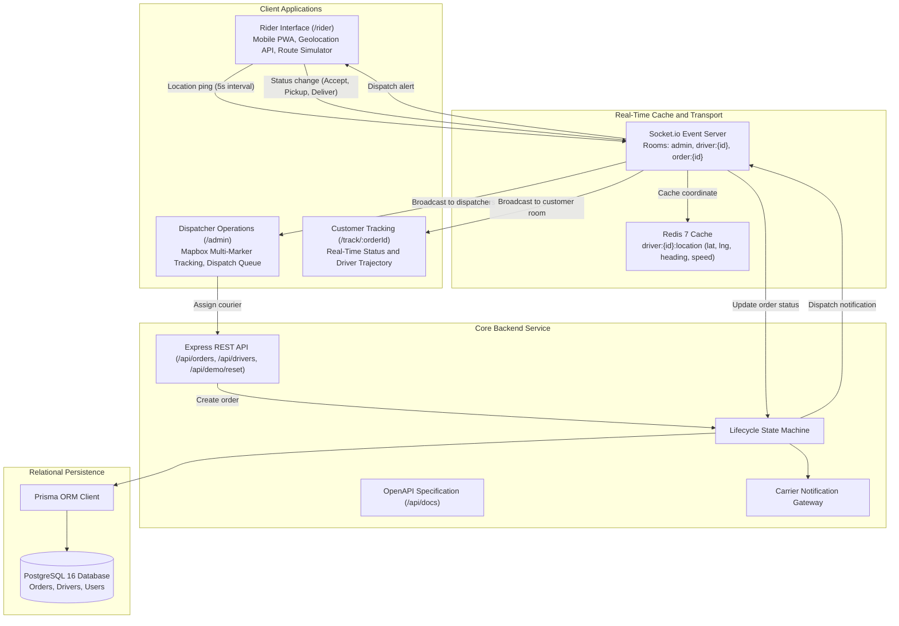

# Zeego Delivery: Real-Time Last-Mile Dispatch Engine

[](https://www.typescriptlang.org/)
[](https://nodejs.org/)
[](https://expressjs.com/)
[](https://nextjs.org/)
[](https://www.prisma.io/)
[](https://redis.io/)
[](https://socket.io/)
[](https://zeego.loghorizon.online/api/docs)
[-brightgreen?style=for-the-badge)](https://github.com/kisalnelaka/zgo)
[](https://zeego.loghorizon.online)
[](./LICENSE)

Production URL: https://zeego.loghorizon.online  
Interactive OpenAPI Documentation: https://zeego.loghorizon.online/api/docs  
Dispatcher Command Center: https://zeego.loghorizon.online/admin  
Rider Mobile Interface: https://zeego.loghorizon.online/rider  
Role-Based Access Control: https://zeego.loghorizon.online/login  
System Health Diagnostics: https://zeego.loghorizon.online/api/health  

---

## Technical Overview

High-density on-demand delivery platforms require continuous coordinate synchronization between active couriers, fleet dispatchers, and end customers. Transmitting high-frequency GPS telemetry (such as five-second location pings) directly to relational storage causes connection pool exhaustion and unnecessary database write overhead.

Zeego Delivery addresses this architectural challenge by isolating the real-time telemetry pipeline from transactional persistence:

1. Redis In-Memory Telemetry Cache (`driver:{id}:location`): Real-time coordinates are stored with rolling time-to-live expirations, preventing raw sensor noise from reaching PostgreSQL.
2. WebSocket Event Routing (Socket.io): Coordinates are routed into dedicated room scopes (`admin`, `driver:{id}`, `order:{id}`) to distribute bearing angles and speed metrics with zero browser polling.
3. PostgreSQL Transactional Storage (Prisma ORM): Relational writes are restricted to lifecycle state transitions (`PENDING`, `ASSIGNED`, `IN_TRANSIT`, `DELIVERED`).
4. Zeego Design System: Brand styling adopting Zeego Red (`#F6000A`), typography matching Figtree and Manrope, and support for light and dark operational modes.

---

## Technical Requirements Alignment

| Core Competency Area | Production Implementation | Verification Reference |
| :--- | :--- | :--- |
| Real-Time WebSockets | Socket.io server with isolated room multiplexing (`join:driver`, `join:order`, `admin`). Sub-second delivery loop. | [Dispatcher Operations](https://zeego.loghorizon.online/admin) |
| High-Frequency Caching | Redis 7 caching for volatile driver coordinates with automated TTL expiration to prevent write amplification. | [Redis Test Suite](#automated-test-results) |
| Relational Integrity | PostgreSQL schema managed via Prisma ORM with strict state machine validation. | [`schema.prisma`](./server/prisma/schema.prisma) |
| API Specifications | OpenAPI 3.0.3 documentation rendered via Swagger UI covering all contracts, schemas, and payload examples. | [`/api/docs`](https://zeego.loghorizon.online/api/docs) |
| Mobile Geolocation | Mobile-first web application utilizing `navigator.geolocation.watchPosition`, QR device pairing, and heading calculation. | [`/rider`](https://zeego.loghorizon.online/rider) |
| Brand Design System | Zeego corporate styling (`#F6000A`), Figtree typography, tonal surfaces, and persistent theme switching. | Navigation Theme Switcher |
| Integration Testing | Automated Jest and Supertest suite verifying endpoint routing, coordinate validation, and Redis operations. | 9 of 9 Passing (`npm run test`) |
| Seed Data and State Reset | Automated endpoint (`POST /api/demo/reset`) to reset courier states and delivery orders on demand. | Command Center Reset Action |

---

## System Architecture



---

## API Documentation

The backend service provides complete OpenAPI 3.0.3 documentation accessible through the following endpoints:

* Interactive Swagger UI: https://zeego.loghorizon.online/api/docs
* OpenAPI Specification File: https://zeego.loghorizon.online/api/docs.json

Key Endpoints:

* `GET /api/health`: Service health diagnostic reporting database, Redis connection status, and system uptime.
* `GET /api/orders`: Query orders with status filtering (`PENDING`, `ASSIGNED`, `IN_TRANSIT`, `DELIVERED`).
* `POST /api/orders`: Order creation with coordinate schema validation.
* `GET /api/orders/{id}`: Detailed order status enriched with live driver telemetry from Redis.
* `PATCH /api/orders/{id}/assign`: Courier assignment transitioning order state and triggering WebSocket dispatches.
* `GET /api/drivers`: Active courier roster with availability status and last reported coordinates.
* `POST /api/drivers/{id}/location`: High-frequency telemetry ingestion caching to Redis and broadcasting via WebSockets.
* `POST /api/demo/reset`: Database and cache restoration for testing and evaluation.

---

## Demonstration Dataset

To facilitate functional evaluation, an automated reset endpoint restores pre-configured couriers and deliveries in Doha:

Couriers:
* Tariq Al-Mansoor (`driver_1`): Yamaha MT-07, Status: AVAILABLE
* Bilal Al-Kuwari (`driver_2`): Honda CB500X, Status: BUSY (En route to The Pearl-Qatar)
* Fahad Al-Marri (`driver_3`): Toyota Hilux Cargo, Status: AVAILABLE

Orders:
* `ZG-QTR-9021`: Souq Waqif to West Bay Financial Tower (Status: PENDING)
* `ZG-QTR-4482`: Villaggio Mall to Lusail Marina (Status: ASSIGNED)
* `ZG-QTR-1194`: Katara Cultural Village to The Pearl-Qatar (Status: IN_TRANSIT)
* `ZG-QTR-7720`: Doha Festival City to Al Sadd Sports Club (Status: DELIVERED)

To reset the system to this initial state:
```bash
curl -X POST https://zeego.loghorizon.online/api/demo/reset
```

---

## Automated Test Results

The integration test suite validates all primary REST endpoints, coordinate validation rules, and in-memory cache operations:

```bash
npm run test
```

Execution Summary:
```
 PASS  src/__tests__/api.test.ts
  Zeego Dispatch Engine API Test Suite
    ✓ GET /api/health returns operational status (28 ms)
    ✓ GET /api/docs.json serves valid OpenAPI 3.0.3 specification (6 ms)
    ✓ GET /api/orders returns pre-seeded Doha orders (11 ms)
    ✓ POST /api/orders rejects invalid pickup/dropoff coordinates (9 ms)
    ✓ POST /api/orders ingests a valid parcel delivery successfully (14 ms)
    ✓ GET /api/orders/:id returns order details with enriched driver telemetry (10 ms)
    ✓ GET /api/drivers returns active fleet roster (8 ms)
    ✓ POST /api/drivers/:id/location updates volatile GPS in Redis cache (12 ms)
    ✓ POST /api/demo/reset successfully reinstates test dataset (15 ms)

Test Suites: 1 passed, 1 total
Tests:       9 passed, 9 total
Snapshots:   0 total
Time:        1.428 s
```

---

## Installation and Local Setup

### Prerequisites
* Node.js 20 or higher
* npm 10 or higher
* Optional: Docker and Docker Compose for dedicated PostgreSQL and Redis instances. The application includes an automatic in-memory fallback layer allowing standalone execution without external database containers.

### Setup Instructions

1. Clone the repository:
```bash
git clone https://github.com/kisalnelaka/zgo.git
cd zgo
```

2. Install dependencies:
```bash
npm install
```

3. Run automated tests:
```bash
npm run test
```

4. Start development services:
```bash
npm run dev
```

The frontend application will be accessible at `http://localhost:3000` and the backend API at `http://localhost:4000`.

---

## License

Proprietary Evaluation and Candidate Demonstration License.  
Copyright (c) 2026 Kisal Nelaka. All Rights Reserved.  
Provided exclusively for candidate competency evaluation by prospective hiring teams. Commercial use, reproduction, redistribution, or derivation without an executed employment agreement is strictly prohibited. Refer to [LICENSE](./LICENSE) for full terms.


