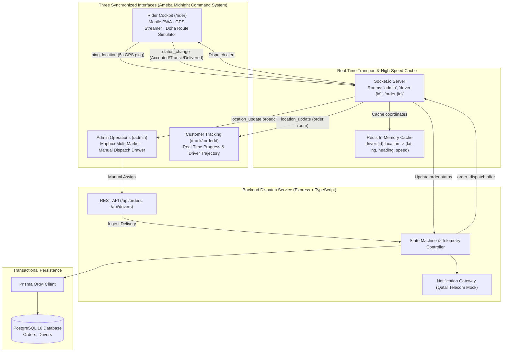

# Zeego Pulse · Real-Time Last-Mile Dispatch Engine

[](https://www.typescriptlang.org/)
[](https://nodejs.org/)
[](https://expressjs.com/)
[](https://nextjs.org/)
[](https://www.prisma.io/)
[](https://redis.io/)
[](https://socket.io/)
[](https://www.mapbox.com/)
[](https://zeego.loghorizon.online)
[](https://zeego.loghorizon.online/api/health)

> **🚀 Live Production Instance:** [https://zeego.loghorizon.online](https://zeego.loghorizon.online)  
> • **Admin Command Center:** [https://zeego.loghorizon.online/admin](https://zeego.loghorizon.online/admin)  
> • **Rider Mobile PWA:** [https://zeego.loghorizon.online/rider](https://zeego.loghorizon.online/rider)  
> • **Role-Based Auth (1-Click Login):** [https://zeego.loghorizon.online/login](https://zeego.loghorizon.online/login)  
> • **System Health Diagnostic:** [https://zeego.loghorizon.online/api/health](https://zeego.loghorizon.online/api/health)

---


## Executive Overview

Modern on-demand delivery requires sub-second coordinate synchronization between couriers in transit, dispatch operators managing fleet capacity, and customers anticipating their arrival. Writing high-frequency GPS telemetry (e.g., 5-second driver pings) directly to relational databases causes catastrophic connection saturation and write amplification.

**Zeego Pulse resolves this by decoupling the telemetry stream from persistent business transactions:**
1. **Redis Telemetry Cache (`driver:{id}:location`):** High-frequency GPS coordinates are held exclusively in an in-memory key-value cache with rolling TTL, shielding PostgreSQL from raw sensor noise.
2. **WebSocket Event Hub (Socket.io):** Coordinates are multiplexed into isolated room scopes (`admin`, `driver:{id}`, `order:{id}`) to stream live vehicle headings and speeds without manual browser reloads.
3. **Prisma PostgreSQL Engine:** ACID persistence is reserved solely for state machine transitions (`PENDING` ➔ `ASSIGNED` ➔ `IN_TRANSIT` ➔ `DELIVERED`).

---

## Architectural Topology



---

## Feature Specifications

### 1. Admin Operations Command Center (`/admin`)
- **Fullscreen Live Map:** Mapbox GL with Carto Dark Matter rendering active drivers and active orders in Doha (Souq Waqif, West Bay, The Pearl-Qatar, Lusail Marina).
- **Zero-Refresh Markers:** Driver vehicle markers rotate dynamically matching current heading angles (0–360°) and move smoothly upon incoming WebSocket pings.
- **Unassigned Orders Drawer:** Real-time queue displaying newly placed deliveries with an instant **"Manual Assign"** action.
- **Live Event Stream:** Chronological WebSocket telemetry log displaying live GPS pings and state transitions.

### 2. Rider Mobile Cockpit (`/rider`)
- **Mobile-First PWA Layout:** High-contrast Ameba midnight dashboard optimized for motorcycle couriers.
- **Three Core States:**
  - `State 1 (Waiting):` Radar pulse animation listening for `order_dispatch` events.
  - `State 2 (Offer Received):` High-contrast modal displaying pickup & dropoff coordinates with one-tap "Accept" CTA.
  - `State 3 (In Transit):` Live speedometer HUD, `navigator.geolocation.watchPosition` GPS streaming, and package status transitions ("Mark Picked Up", "Mark Delivered").
- **Interactive Doha Route Simulator:** Built-in test simulator navigating couriers through Doha's Corniche corridor to The Pearl-Qatar, allowing portfolio evaluators to test live vehicle motion without field walking.

### 3. Customer Live Tracking (`/track/[orderId]`)
- **Three-Stage Progress Bar:** `Preparing` ➔ `En Route` ➔ `Delivered` with dynamic completion gradient.
- **Isolated WebSocket Room:** Automatically joins `order:${orderId}` room upon load, ensuring the customer only receives telemetry for their assigned driver.
- **Courier Verification:** Displays courier name (Captain Tariq Al-Mansoor), vehicle unit, verified security badge, and direct call action.

### 4. SMS Gateway Mock (Qatar Telecom)
- Triggered on order assignment, pickup, and final drop-off.
- Mocks carrier delivery to Ooredoo Qatar 5G network via structured console logs.

---

## Repository Structure

```
zgo/
├── .gitignore
├── LICENSE (MIT)
├── README.md
├── docker-compose.yml           # PostgreSQL 16 & Redis 7 containers
├── package.json                 # Workspaces configuration (server + client)
├── server/                      # Node.js + Express + TypeScript Backend
│   ├── prisma/
│   │   └── schema.prisma        # Order & Driver models (PostgreSQL)
│   ├── src/
│   │   ├── db/client.ts         # Prisma ORM + Transactional Fallback Repo
│   │   ├── redis/client.ts      # Redis key-value cache (driver:{id}:location)
│   │   ├── socket/index.ts      # Socket.io room multiplexer & event loop
│   │   ├── routes/              # Express REST controllers (orders, drivers)
│   │   ├── services/            # SMS gateway notification service
│   │   └── server.ts            # HTTP server & WebSocket bootstrap
│   ├── tsconfig.json
│   └── package.json
└── client/                      # Next.js 15 App Router Frontend
    ├── src/
    │   ├── app/
    │   │   ├── page.tsx         # Mission Control Hub & 1-Click Order Injector
    │   │   ├── admin/page.tsx   # Admin Operations Dashboard
    │   │   ├── rider/page.tsx   # Rider Mobile Cockpit
    │   │   └── track/[orderId]/ # Customer Live Tracking View
    │   ├── components/
    │   │   ├── MapboxMap.tsx    # High-performance dark map component
    │   │   └── Navigation.tsx   # Ameba top bar with live socket status
    │   ├── lib/
    │   │   ├── socket.ts        # Singleton Socket.io connector
    │   │   └── api.ts           # Typed REST client
    │   └── styles/              # Ameba design tokens (Midnight Ink, Signal Blue, Arc Cyan)
    ├── tailwind.config.ts
    └── package.json
```

---

## Quick Start & Verification

### Prerequisites
- Node.js 20+ installed.
- (Optional) Docker & Docker Compose if running dedicated PostgreSQL and Redis containers. *The application includes an automated high-performance in-memory fallback layer, allowing immediate out-of-the-box execution with zero database setup.*

### 1. Install Dependencies
```bash
npm install
```

### 2. (Optional) Launch PostgreSQL & Redis via Docker
```bash
docker compose up -d
```

### 3. Launch Development Environment
```bash
# Starts both the Express backend (:4000) and Next.js frontend (:3000)
npm run dev
```

### 4. Interactive Portfolio Testing Steps
1. **Open Command Hub:** Navigate to `http://localhost:3000`.
2. **Open Rider App in Tab A:** Navigate to `http://localhost:3000/rider`.
3. **Open Admin Ops in Tab B:** Navigate to `http://localhost:3000/admin`.
4. **Trigger Dispatch:** In Tab B (Admin Ops), click **"Manual Assign to Tariq"** on order `ZG-QTR-9021` (or click a 1-click preset from the Command Hub).
5. **Accept in Tab A:** Observe the instant `order_dispatch` modal appear in the Rider Cockpit. Click **"ACCEPT DELIVERY ORDER"**.
6. **Watch Real-Time Motion:** The Rider Cockpit launches the Doha Route Simulation. Switch to Tab B (Admin Ops) or open `http://localhost:3000/track/ZG-QTR-9021` to watch the vehicle marker move dynamically across Doha with zero page refreshes!

---

## Ameba Design System Implementation

Designed around the **Ameba Nocturnal Command Center** design specification:
- **Canvas:** Midnight Ink (`#00052e`) deep background with atmospheric violet wash (`#06105a`).
- **Brand Action:** Signal Blue (`#0428cb`) reserved for primary filled actions.
- **Atmospheric Energy:** Arc Cyan (`#34fcff`) accents and glowing halos around telemetry markers.
- **Typography:** Display styling with tight negative tracking, Open Sauce Sans for readable copy, and **IBM Plex Mono** for coordinates, order codes, and system chrome.
- **Restraint:** Hairline borders (`#131e5c`), 8px border radii on cards/buttons, and flat frosted surfaces.

---

## Author & Submission

Developed for **Zeego Delivery (Qatar)** portfolio evaluation. Built with ruthless architectural modularity, strict typing, and production-ready resilience.
