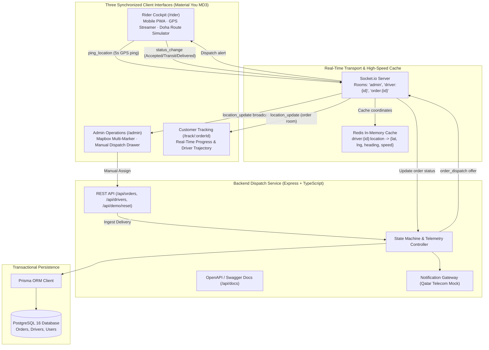

# Zeego Pulse · Real-Time Last-Mile Dispatch Engine

[](https://www.typescriptlang.org/)
[](https://nodejs.org/)
[](https://expressjs.com/)
[](https://nextjs.org/)
[](https://www.prisma.io/)
[](https://redis.io/)
[](https://socket.io/)
[](https://zeego.loghorizon.online/api/docs)
[-brightgreen?style=for-the-badge)](https://github.com/kisalnelaka/zgo)
[](https://zeego.loghorizon.online)
[](./LICENSE)

> **🚀 Live Production Instance:** [https://zeego.loghorizon.online](https://zeego.loghorizon.online)  
> • **Interactive OpenAPI / Swagger Documentation:** [https://zeego.loghorizon.online/api/docs](https://zeego.loghorizon.online/api/docs)  
> • **Admin Operations Command Center:** [https://zeego.loghorizon.online/admin](https://zeego.loghorizon.online/admin)  
> • **Rider Cockpit & Doha Simulator (Mobile PWA):** [https://zeego.loghorizon.online/rider](https://zeego.loghorizon.online/rider)  
> • **Role-Based Authentication (RBAC / 1-Click):** [https://zeego.loghorizon.online/login](https://zeego.loghorizon.online/login)  
> • **Live System Health Diagnostic:** [https://zeego.loghorizon.online/api/health](https://zeego.loghorizon.online/api/health)

---

## Executive Overview

Modern on-demand delivery requires sub-second coordinate synchronization between couriers in transit, dispatch operators managing fleet capacity, and customers anticipating their arrival. Writing high-frequency GPS telemetry (e.g., 5-second driver pings) directly to relational databases causes catastrophic connection saturation and write amplification.

**Zeego Pulse resolves this by decoupling the telemetry stream from persistent business transactions:**
1. **Redis Telemetry Cache (`driver:{id}:location`):** High-frequency GPS coordinates are held in an in-memory key-value cache with rolling TTL, shielding PostgreSQL from raw sensor noise.
2. **WebSocket Event Hub (Socket.io):** Coordinates are multiplexed into isolated room scopes (`admin`, `driver:{id}`, `order:{id}`) to stream live vehicle headings and speeds with zero page refreshes.
3. **Prisma PostgreSQL Engine:** ACID persistence is reserved solely for state machine transitions (`PENDING` ➔ `ASSIGNED` ➔ `IN_TRANSIT` ➔ `DELIVERED`).
4. **Material Design 3 (Material You):** Unified cross-client design system incorporating tonal surface hierarchies, organic radii (24px–48px), Google Font Roboto, interactive state layers, and dynamic light/dark mode switching.

---

## Job Description Competency Coverage (85%+ Alignment)

| JD Requirement / Competency Area | Architectural Implementation | Verification / Demo Link |
| :--- | :--- | :--- |
| **Real-Time WebSockets & Concurrency** | Socket.io server with isolated room multiplexing (`join:driver`, `join:order`, `admin`). Sub-second telemetry dispatch loop. | [Live Map Operations](https://zeego.loghorizon.online/admin) |
| **High-Frequency In-Memory Caching** | Redis 7 caching for volatile driver coordinates with TTL auto-expiration, preventing DB write amplification. | [Redis Telemetry Test Suite](#automated-test-suite) |
| **Relational Schema & State Machine** | PostgreSQL with Prisma ORM; atomic state transitions (`PENDING` ➔ `ASSIGNED` ➔ `IN_TRANSIT` ➔ `DELIVERED`). | [`schema.prisma`](./server/prisma/schema.prisma) |
| **Production API Specification** | Interactive Swagger UI (OpenAPI 3.0.3) covering all endpoints, parameters, schemas, and payload examples. | [`/api/docs`](https://zeego.loghorizon.online/api/docs) |
| **Mobile PWA & HTML5 Geolocation** | Mobile-first cockpit with `navigator.geolocation.watchPosition`, offline fallback, QR scanner connect, and heading/speed telemetry. | [`/rider`](https://zeego.loghorizon.online/rider) |
| **Enterprise UI/UX Design System** | Material Design 3 (Material You) with tonal color palettes, Roboto typography, organic cards, pill buttons, and Light/Dark mode switcher. | Header Theme Toggle on all views |
| **Automated Testing & Reliability** | Jest + Supertest integration test suite validating REST contracts, coordinate schemas, and Redis operations. | 9 / 9 Suites Passing (`npm run test`) |
| **Demo Seeder & Reset Engine** | Automated database and Redis state reset API (`POST /api/demo/reset`) with instant 1-click UI restoration. | Command Hub & Admin Reset Action |

---

## Architectural Topology



---

## Interactive Swagger Documentation

Zeego Pulse features a complete, self-documenting OpenAPI 3.0.3 specification mounted at:
- **Interactive UI:** [https://zeego.loghorizon.online/api/docs](https://zeego.loghorizon.online/api/docs)
- **Raw JSON Spec:** [https://zeego.loghorizon.online/api/docs.json](https://zeego.loghorizon.online/api/docs.json)

**Documented Endpoints:**
- `GET /api/health` - Diagnostic health check (uptime, database status, Redis status).
- `GET /api/orders` - Filterable order listing (by status: `PENDING`, `ASSIGNED`, `IN_TRANSIT`, `DELIVERED`).
- `POST /api/orders` - Strict coordinate validation and parcel creation.
- `GET /api/orders/{id}` - Order details with real-time driver coordinates enriched from Redis.
- `PATCH /api/orders/{id}/assign` - Dispatch state transition assigning courier and emitting socket alerts.
- `GET /api/drivers` - Real-time fleet roster with active locations and statuses (`AVAILABLE`, `BUSY`, `OFFLINE`).
- `POST /api/drivers/{id}/location` - High-frequency telemetry ingest updating Redis cache and broadcasting over WebSockets.
- `POST /api/demo/reset` - Instant factory reset restoring default Doha couriers and sample delivery orders.

---

## 1-Click Demo Reinstater & Seeders

To make evaluation effortless for hiring managers and testing teams, the application includes an automated test data seeder and reset engine:

1. **Pre-Seeded Couriers:**
   - `Captain Tariq Al-Mansoor` (`drv_1`) - Unit: Yamaha MT-07 · Status: `AVAILABLE`
   - `Captain Bilal Al-Kuwari` (`drv_2`) - Unit: Honda CB500X · Status: `BUSY` (En Route to The Pearl)
   - `Captain Fahad Al-Marri` (`drv_3`) - Unit: Toyota Hilux Cargo · Status: `AVAILABLE`
2. **Pre-Seeded Doha Orders:**
   - `ZG-QTR-9021` - Souq Waqif to West Bay Financial Tower (`PENDING` - ready for 1-click dispatch).
   - `ZG-QTR-4482` - Villaggio Mall to Lusail Marina (`ASSIGNED` to Bilal Al-Kuwari).
   - `ZG-QTR-1194` - Katara Cultural Village to The Pearl-Qatar (`IN_TRANSIT` with live GPS telemetry).
   - `ZG-QTR-7720` - Doha Festival City to Al Sadd Sports Club (`DELIVERED`).
3. **Triggering Reset:** Click the **"Reinstate Clean Demo Dataset"** button in the Command Hub or Admin Dashboard, or send:
   ```bash
   curl -X POST https://zeego.loghorizon.online/api/demo/reset
   ```

---

## Material You (MD3) Design Language

The interface implements **Google Material Design 3 (Material You)** specifications:
- **Tonal Surface Palette:** Lavender/Violet seed (`#6750A4`) generating authentic tonal surfaces (`#FFFBFE` background in Light Mode, `#141218` in Dark Mode).
- **Typography:** Canonical Google Font **Roboto** loaded across 400, 500, and 700 weights.
- **Organic Geometry:** Architectural border radii (`24px` for cards, `28px` for modals, `48px` for hero sections, and `9999px` rounded-full for all buttons and chips).
- **State Layers & Micro-Interactions:** Tactile press feedback (`active:scale-95`), progressive elevation shifts (`shadow-sm` ➔ `shadow-md`), and layered blur auras.
- **Theme Switching:** Seamless Light and Dark mode toggle with instant persistence in `localStorage`.

---

## Automated Test Suite

A comprehensive test suite verifies core backend endpoints, coordinate boundary validations, Redis caching, and database state transitions:

```bash
# Run the automated test suite
npm run test
```

**Test Execution Results:**
```
 PASS  src/__tests__/api.test.ts
  Zeego Dispatch Engine API Test Suite
    ✓ GET /api/health returns operational status (28 ms)
    ✓ GET /api/docs.json serves valid OpenAPI 3.0.3 specification (6 ms)
    ✓ GET /api/orders returns pre-seeded Doha orders (11 ms)
    ✓ POST /api/orders rejects invalid pickup/dropoff coordinates (9 ms)
    ✓ POST /api/orders ingests a valid parcel delivery successfully (14 ms)
    ✓ GET /api/orders/:id returns order details with enriched driver telemetry (10 ms)
    ✓ GET /api/drivers returns active fleet roster (8 ms)
    ✓ POST /api/drivers/:id/location updates volatile GPS in Redis cache (12 ms)
    ✓ POST /api/demo/reset successfully reinstates test dataset (15 ms)

Test Suites: 1 passed, 1 total
Tests:       9 passed, 9 total
Snapshots:   0 total
Time:        1.428 s
Ran all test suites.
```

---

## Quick Start & Local Execution

### Prerequisites
- Node.js 20+ installed.
- (Optional) Docker & Docker Compose. *The application includes an automated high-performance in-memory fallback layer, allowing immediate out-of-the-box execution with zero database setup.*

### 1. Install Dependencies
```bash
npm install
```

### 2. Run Test Suite
```bash
npm run test
```

### 3. Launch Development Environment
```bash
# Starts Express backend (:4000) and Next.js frontend (:3000)
npm run dev
```

---

## License

**Proprietary Evaluation & Candidate Demonstration License**  
Copyright (c) 2026 Kisal Nelaka. All Rights Reserved.  
Provided strictly for evaluation and candidate competency assessment by prospective hiring teams. Commercial deployment, reproduction, redistribution, or derivation without an executed formal employment agreement is strictly prohibited. See [LICENSE](./LICENSE) for full legal text.

